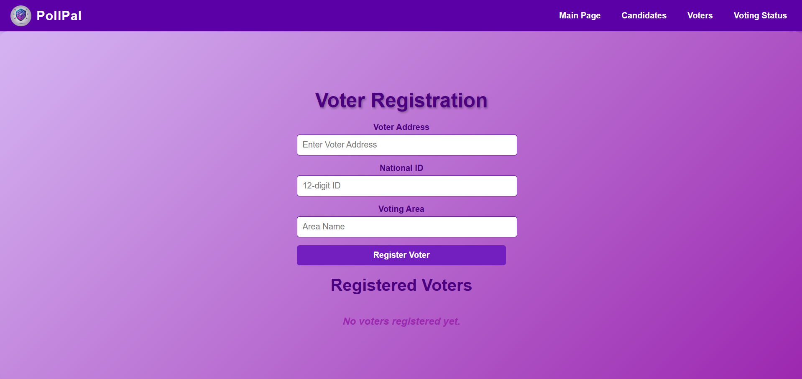

GROUP 2 - Blockers
   ‘PollPal’ - Voting Dapp  
Prepared by Nur Athisha Binti Mohd Zariman (2118676), Nuur Nadheerah Binti Mohammad Lutfi (2117898) & Nur Huda Binti Eshaifol Azam (2111994)  

 

**1. Use Case Diagram**
  

  

**2. System Architecture Diagram**
  

  

**3. Frontend**
 
The frontend is developed using React.js, CSS and HTML providing an interactive and user-friendly interface for both voters and admins. It integrates seamlessly with the Ethereum blockchain through MetaMask and Ethers.js.   

| **Interface** | **Functionality** |
|---------------|------------------|
| Admin Interface|-Log in using MetaMask with authentication based on the admin address stored in the smart contract.  -Register voters and candidates through dedicated forms.  -Control the voting lifecycle by starting or ending the voting session.  -View election results for specific voting areas. |
| Voter Interface|-Connect to MetaMask for authentication.   -View candidates in the voter's registered voting area.  -Verify voter identity using a National ID.  -Cast votes securely and receive feedback on the status of their vote.|

  

**4. Frontend Interface**
  

Main Page
 

| **Main Page** |
|---------------|
|  |

| **Election Result** |
|------------------|
| |

  
Admin Dashboard
 

| **Admin Panel Page** |
|----------|
|        |

| **Candidates Page** |
|----------|
|         |

| **Voters Page** |
|----------|
|      |

  
Election Dashboard
 

| **Voter Panel Page** |
|----------|
|     |

  

**5. Group Contribution**
 

| **Name** | **Contribution** |
|----------|------------------|
| Nur Athisha Binti Mohd Zariman (2118676)|Phase 1   - registerCandidate  - registerVoter  - castVote  - getResultsByArea  - Manage validation rules, compile and testing smart contract   Phase 2   -Backend  -Frontend (Make everything functional)|
| Nuur Nadheerah Binti Mohammad Lutfi (2117898)|Phase 1   - candidatesByArea  - areaVoteCount  - voters  - Use Case Diagram   Phase 2   -Design frontend  -CSS |
| Nur Huda Binti Eshaifol Azam (2111994)|Phase 1   - startVoting  - endVoting  - getCandidatesByArea  - System Architecture Diagram   Phase 2   -Unit Testing  -Report | 
