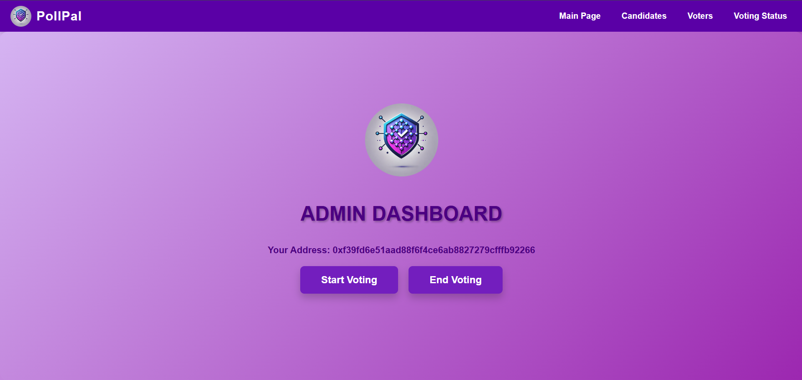
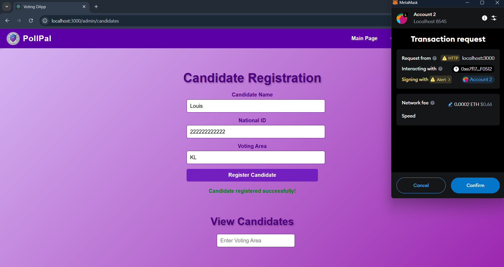

GROUP 2 - Blockers
   ‘PollPal’ - Voting Dapp  
Prepared by Nur Athisha Binti Mohd Zariman (2118676), Nuur Nadheerah Binti Mohammad Lutfi (2117898) & Nur Huda Binti Eshaifol Azam (2111994)  

 

**1. Use Case Diagram**

  

**2. System Architecture Diagram**

  

**3. Frontend**
 
The frontend is developed using React.js, CSS and HTML providing an interactive and user-friendly interface for both voters and admins. It integrates seamlessly with the Ethereum blockchain through MetaMask and Ethers.js.   

| **Interface** | **Functionality** |
|---------------|------------------|
| User Interface|-Connect to MetaMask for authentication.   -View candidates in the voter's registered voting area.  -Verify voter identity using a National ID.  -Cast votes securely and receive feedback on the status of their vote.|
| Admin Interface|-Log in using MetaMask with authentication based on the admin address stored in the smart contract.  -Register voters and candidates through dedicated forms.  -Control the voting lifecycle by starting or ending the voting session.  -View election results for specific voting areas. |

  

**4. Frontend Interface**
 

Main Page
 

| **Main Page** | **Election Result** |
|----------|------------------|
|  | |

Admin Dashboard
 

| **Candidates Page** | **Candidates Page** |
|----------|------------------|
|        |       |

SCHEDULE
 
|   |   |
|----------|------------------|
| **Schedule page**   |**All activity page**   |
| **Add event page**   |**Event details page**   |

REMINDER
 
|   |   |
|----------|------------------|
| **Reminder page**   |**Set date and time for reminder**   |
| **Edit name of reminder**   | |

FAMILY MEMBERS' PROFILES
 
|   |   |
|----------|------------------|
| **Family member's profile page**   |**Create profile**   |
| **Profile details**   |**Edit profile**   |

  

**5. Sequence Diagram**
 
Login
 

Schedule
 

Reminder
 

Family Members Profile 
 

  

**6. Weekly Progress Report**
  

  

**7. Group Contribution**
  

| **Name** | **Contribution** |
|----------|------------------|
| Nur Athisha Binti Mohd Zariman (2118676)|Schedule Pages  - schedule.dart  - add_event_page.dart  - view_all_events_page.dart  - event_details_page.dart  |
| Nora Alissa binti Ismail (2117862)|Family Profile Pages  - create_profile_page.dart  - edit_profile_page.dart  - home_page.dart  - members_detail_page.dart  - members_profile_page.dart  - firestore.dart  - member.dart  - nav_bar.dart   |
| Adriana binti Anuar Kamal (2025778)|Login and Reminder Pages   - main.dart  - reminder.dart  - auth.dart  - notification_service.dart  - reminder_page.dart  - login_register_page.dart | 
